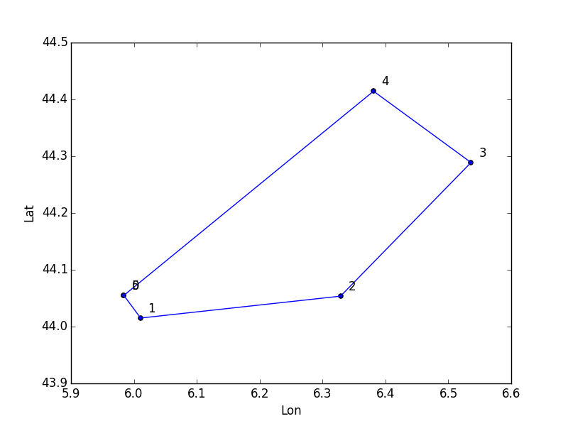

# pycondor
Python script to manage some Condor Soaring files such as task

CAUTION: WORK IN PROGRESS - NOT USABLE FOR NOW

See [ToDo](https://github.com/scls19fr/pycondor/wiki/ToDo) Any help is Welcome!

## Usage

	C:\...\pycondor> python.exe pycondor_task.py samples/default.fpl --debug --output xls
	Read 'samples/default.fpl'
	Condor version: 1150
	Using functions from 'C:\Program Files (x86)\Condor\NaviCon.dll'
	With landscape 'alps_XL'

	MaxX: 501120.000000
	MaxY: 282240.000000
	XYToLon(0.0,0.0): 13.332527
	XYToLat(0.0,0.0): 45.330540
	XYToLon(501120.000000,282240.000000): 6.835280
	XYToLat(501120.000000,282240.000000): 47.933624

	   Airport Altitude Angle Azimuth Height              Name            PosX  \
	0        1     1500  8105       0   5000       Saint Auban   144740.828125
	1        0     1500    90       0   2500                Go   142760.828125
	2        0     1600   360       0   5000           Coupe S  117142.2265625
	3        0     2700   360       0   5000         3 Eveches   99735.8203125
	4        0     2200   360       0   5000  DORMILLOUSE FORT  111656.5078125
	5        1     1500   180       0   5000       Saint Auban   144740.828125

				 PosY  PosZ Radius  SectorType Width        Lat        Lon
	0   96078.7265625   450   3000           0     0  46.250069  11.526401
	1   91578.7265625   810   3000           0     0  46.209023  11.550188
	2    94980.953125  1543    500           0     0  46.231731  11.883536
	3  120593.0859375  2663   1000           0     0  46.456097  12.122073
	4   134922.265625  2159    500           0     0  46.589077  11.974069
	5   96078.7265625   450   3000           0     0  46.250069  11.526401
	Output 'out\default.xls'	

## Help
You can get command line help using:

	C:\...\pycondor> python.exe pycondor_task.py --help
	
##Dependencies
* Windows (because of DLL function calls to `NaviCon.dll`)
* Python 2.7 or Python 3.4

You might install a scientific Python distribution such as [Anaconda Python](http://continuum.io/).
Using such a distribution the following libraries should ever be installed:
* Numpy http://www.numpy.org/
* Pandas http://pandas.pydata.org/
* matplotlib http://matplotlib.org/

You will probably need to install missing libraries such as:
* click (Command Line Interface Creation kit) http://click.pocoo.org/
* xlwt (for Excel .xls output with Python 2.x) http://www.python-excel.org/
* xlwt-future (for Excel .xls output with Python 3.x) https://pypi.python.org/pypi/xlwt-future

Use

    > conda install name_of_the_package

or

    > pip install name_of_the_package

to install missing libraries.
